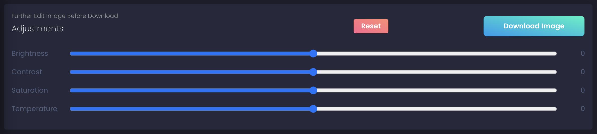
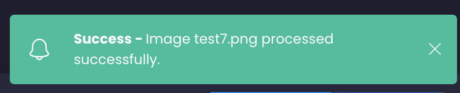
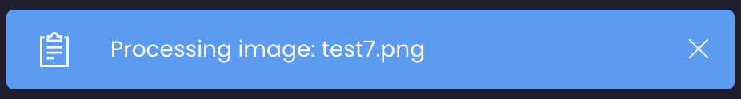
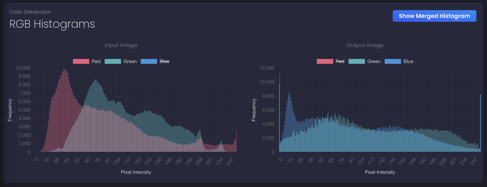
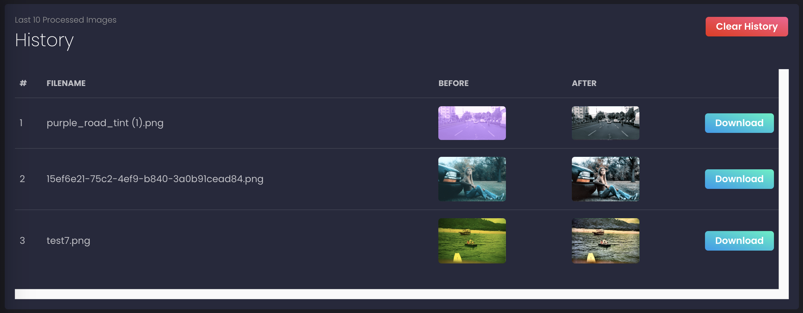

# Color Cast Removal (CCR) Website

CCRWebsite is a frontend user interface for a color cast removal web application. Built with React and styled using the [Black Dashboard React](https://github.com/creativetimofficial/black-dashboard-react?tab=readme-ov-file) template, the UI provides image upload, processing feedback, history tracking, and histogram visualizations, all integrated with a [backend](https://github.com/aphyueh/ccrbackend) server via API calls configured through environment variables.

## Features

- **Image Upload and Color Cast Removal**
  - Upload any image from your local device.
  - Send it to the backend API for automated color cast removal.
  - Processed image is returned and displayed with comparison.

- **Notifications System**
  - In-app alerts for:
    - *Processing Info*: Displays when image processing starts.
    - *Success*: Indicates successful image processing.
    - *Error*: Shown when backend fails to respond or processing fails.
    - *Loading*: Notifies the initialisation of model
    - *Clean up*: Informs the cleaning up of previous files.

- **History Tracking**
  - View the last 10 uploaded and processed image results.
  - Includes thumbnails for input and output images.
  - Re-download any of the recent images without re-uploading.

- **RGB Histogram Visualization**
  - Toggleable histograms comparing input vs output images.
  - Displays Red, Green, and Blue channel distribution curves.
  - Useful for evaluating the effect of color cast removal.

- **Responsive Dashboard UI**
  - Clean layout with side navigation.
  - Mobile-friendly, responsive design.
  - Dark-themed interface.

## Getting Started
### Prerequisites
- Node.js (v14+ recommended)
- npm (v6+)

### Installation
1. Clone the Repository

```bash
git clone https://github.com/aphyueh/CCRWebsite.git
cd CCRWebsite
```
2. Install Dependencies

```bash
npm install
```

3. Environment Setup

Create a `.env` file in the project root with the following:

```python
REACT_APP_API_BASE_URL=https://ccrbackend-1005035431569.asia-southeast1.run.app
```

4. Run Locally

```bash
npm start
```
Visit `http://localhost:3000 `in your browser.

## Docker Deployment
Build and run the application using Docker:
```bash
gcloud builds submit --tag gcr.io/<project-id>/<website-name>

gcloud run deploy <website-name> \
  --image gcr.io/<project-id>/<website-name> \
  --platform managed \
  --region <region> \
  --allow-unauthenticated
```

A service URL will be provided.

## Scripts
`npm start` – Run in development mode.

`npm run build` – Compile and optimize for production.

`npm test` – Launch test runner.

## 📁 Project Structure

```plaintext
CCRWebsite/
├── public/                 # Static assets
├── src/
│   ├── assets/             # Logo, images
│   ├── components/         # Image cards, sliders, histograms, notifications
│   ├── layouts/            # Main dashboard layout
│   ├── views/
│   │   ├── Dashboard.js    # Main page with upload, compare, histogram
│   │   ├── History.js      # History page with last 10 processed images
│   │   └── Notifications.js# Notification triggers and handlers
│   └── index.js            # App entry point
├── .env                    # Backend API base URL
├── Dockerfile              # Docker deployment file
├── package.json            # Project metadata and scripts
├── genezio.yaml            # Genezio deployment settings
└── README.md               # You're here!
```
## Browser Support

At present, we officially aim to support the these browsers:

 
 
 
 


## Advanced Features
### Adjustments
Further edits to the processed image:
- Brightness
- Contrast
- Saturation
- Temperature



### Notifications
Real-time alerts guide the user during interactions:

- Info: Image is being processed.
- Success: Output image received.
- Error: Failed request or unexpected result.




Implemented using the `react-notification-alert` package.

### RGB Histogram

- Uses canvas rendering to draw histograms of R/G/B values.
- Visually compare image channels before and after processing.
- Accessible via the toggle in the dashboard.




### Image History
- Maintains a local state record of the 10 most recent image processing sessions.
- Stored in memory during the session.
- Available on the "History" page.




## Reporting Issues
We use GitHub Issues as the official bug tracker for the Color Cast Removal Tool. Here are some advices for our users that want to report an issue:

Make sure that you are using the latest version of the CCRWebsite. Check the CHANGELOG from your dashboard on our website.
Providing us reproducible steps for the issue will shorten the time it takes for it to be fixed.
Some issues may be browser specific, so specifying in what browser you encountered the issue might help.

## Technical Support or Questions
If you have questions or need help integrating the product please contact us instead of opening an issue.

## License
This project is licensed under the MIT License.

## Acknowledgements
- Black Dashboard React

- React

- Bootstrap 4

- Reactstrap

